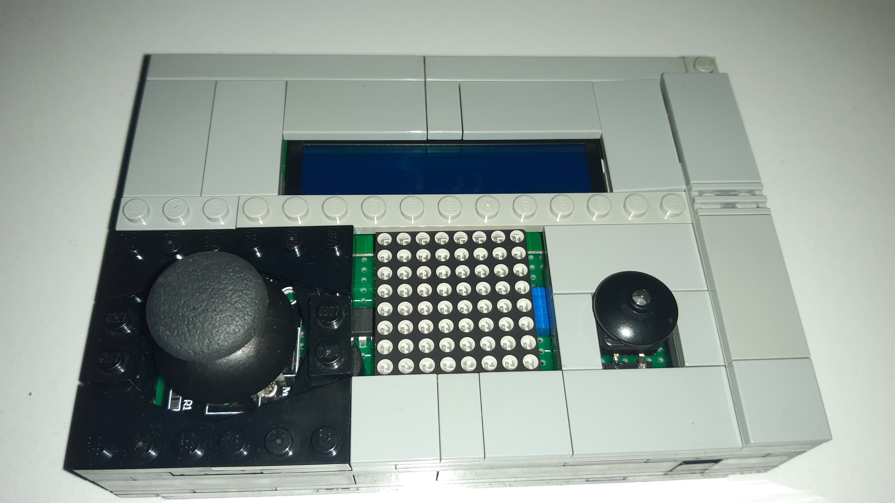
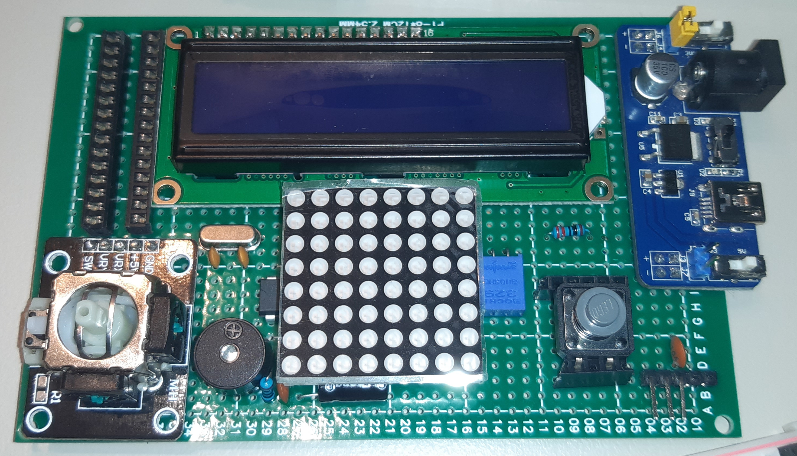
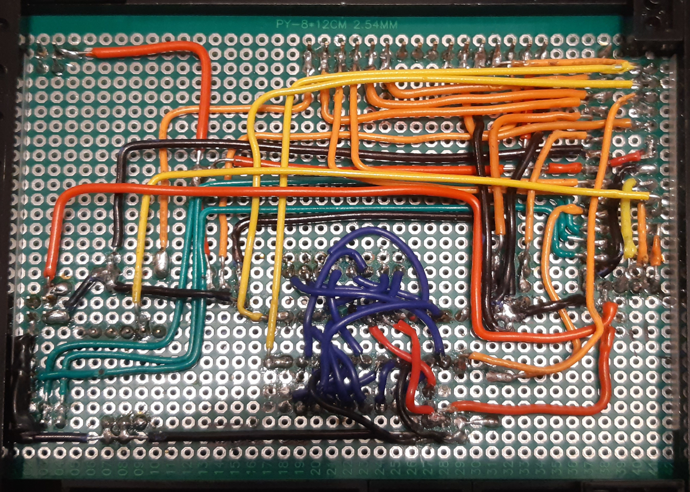

# Maze escape

This repository contains the code of the matrix project for the Introduction to Robotics course taken at Faculty of Mathematics and Computer Science, University of Bucharest (1st semester, 3rd year).

_Maze escape_ is a simple 8x8 matrix game in which the player has to find the exit of the maze while keeping out of enemies.

The project is powered by an Atmega328P microcontroller and has a case made out of LEGO bricks.

## Task description
The objective of the project is to create a matrix game, using as input joystick movement and button switch press and as 

output a 16x2 LCD display and a 8x8 LED matrix. The project should also include user interface (user navigable menu) in order to:

- start the game
- manage game settings (LCD and matrix brightness, sounds on / off)
- manage highscores (see highscore and reset leaderboard)
- help and about screens

## Game description

The objective of the game is to reach the exit of the maze. 

Through the map there are randomly placed enemies who can move and shoot at you. If they touch or shoot you, you loose a life. At the start of the game you have 3 lives.

You can also shoot enemies by pressing the action button. The bullet will be oriented in the last direction you moved. 

You gain points, based on current level, by shooting down enemies and reaching the exit of the maze (bonus points if more lives remaining).

Upon reaching the maze exit, you get to the next level. Higher levels have more enemies that behave more aggresivelly.

## How to play

At device startup, the user is presented with the main menu. Using the joystick, the user can navigate through the options. To select an option, the user has to press the action button. The menu contains options for configuring the LCD display and LED matrix brightness, to enable or disable the sounds and to see or clear the leaderboard.

Upon pressing the start game option, the game starts and the player has to move their position (represented by a slowly blinking dot) using joystick movements. The player can fire a bullet in the last direction they moved using the action button. Enemies (represented by intermittently blinking dot), can randomly move around and shoot you if in range. The maze exit is represented by a rapidly blinking dot.

If the player looses all lives, the game ends and the user is taken back to the main menu. If the user won, a congratulaotry message is shown and if the score obtained is on the leaderboard, the user is instructed to enter thier name to be saved along with the score. Then the user is returned to the main screen.

## Showcase

Video demo: [link]()

## Implementation details

### Hardware
The components are soldered to a prototyping board along with connection wires.

The project uses the following electronic components:

- Atmega328P microcontroller
- LM1602 LCD Display (for menu interface and game status display)
- 8x8 LED matrix (for game display)
- joystick (for menu navigation and game movement)
- button (for menu selection and game action)
- MAX7219 LED driver integrated circuit (to controll the LED matrix)
- a passive buzzer
- breadboard power supply
- various resistors (10k ohm for LED matrix, 10k for microcontroller reset debounce, 100 ohm for passive buzzer and 220 ohm for LCD backlight LED)
- various capacitors (100nF and 10 uF for ground filtering, 100nF for microcontroller reset debounce, 2 22pF for crystal oscilator)
- 16MHz crystal oscilator (high precision oscilator for microcontroller)
- connection wires
- connection sockers for microcontroller and LED matrix

The board is enclosed in a case made with LEGO bricks. This improves the build durability and aesthetic.

The microcontroller has the Arduino bootloader burned (using the ICSP pins and an Arduino board as ISP programmer, using [this guide](https://docs.arduino.cc/built-in-examples/arduino-isp/ArduinoISP)).

On the side of the case there are 3 pins that can be used for serial programming, using an USB to serial chip (such as [FT232](https://ftdichip.com/products/ft232rl/)).

## Resources

These are the resources that helped me design and program the project:

- Create custom characters and matrix images
  - [https://omerk.github.io/lcdchargen/](https://omerk.github.io/lcdchargen/)
  - [https://xantorohara.github.io/led-matrix-editor](https://xantorohara.github.io/led-matrix-editor/)

- Build for using Atmega328P sepparated from arduino board
  - [https://www.electronicshub.org/make-your-own-arduino-board/](https://www.electronicshub.org/make-your-own-arduino-board/)
  - [https://docs.arduino.cc/hacking/hardware/building-an-arduino-on-a-breadboard](https://docs.arduino.cc/hacking/hardware/building-an-arduino-on-a-breadboard)
  - [https://www.instructables.com/DIY-Arduino-UNO-How-to-Make-Your-Own-Arduino-Uno-B/](https://www.instructables.com/DIY-Arduino-UNO-How-to-Make-Your-Own-Arduino-Uno-B/)

- Burning Arduino bootloadere on Atmega328P microcontroller
  - [https://www.instructables.com/Burning-Bootloaders-Into-AVRs-Using-Arduino/](https://www.instructables.com/Burning-Bootloaders-Into-AVRs-Using-Arduino/)
  - [https://docs.arduino.cc/built-in-examples/arduino-isp/ArduinoISP](https://docs.arduino.cc/built-in-examples/arduino-isp/ArduinoISP)
  
- Note frequencies for buzzer sounds
  - [https://docs.arduino.cc/built-in-examples/digital/toneMelody](https://docs.arduino.cc/built-in-examples/digital/toneMelody)
